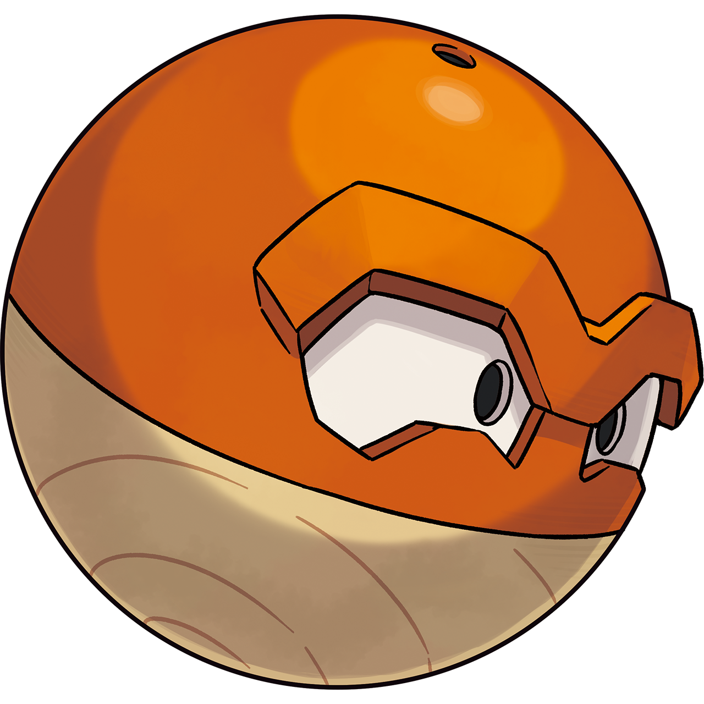
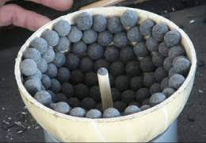
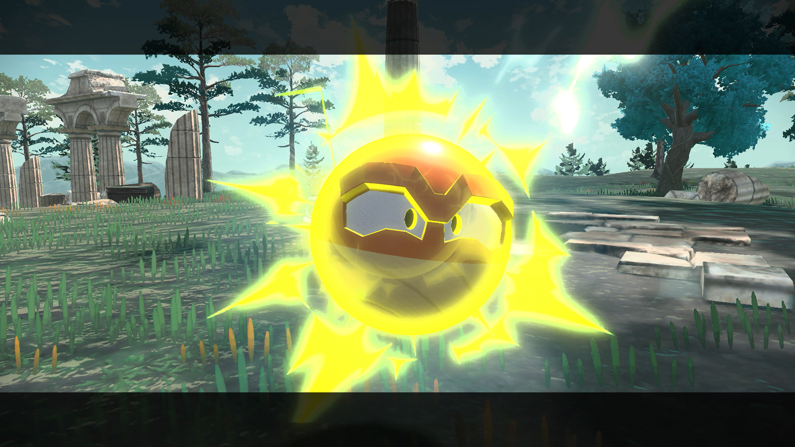
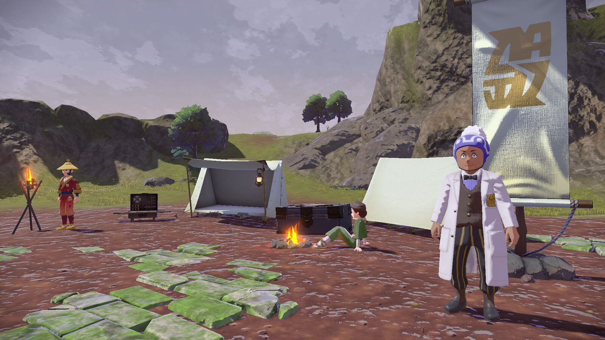
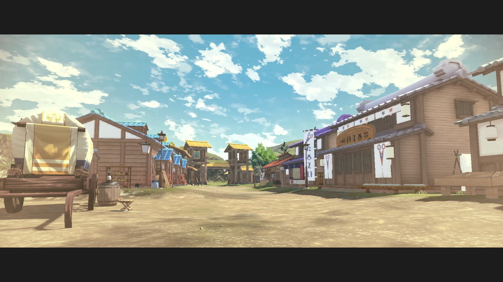

# Hisui's New Power Plant
## Approach

In order to calculate the number of Voltorbs needed to power Jubilife Village, we need to know 2 things:
* Total energy requirements of Jubilife Village
* Total energy output of 1 Hisuian Voltorb

We can then divide the total energy requirements by the total energy output to get a rough estimate of how many Voltorbs we would need to catch to power the whole village. A few additional Voltorb would be need as failsafe, as this power plant would generate energy for the entire village.

## Voltorb Energy Output
### Assumptions
Hisuian Voltorb is described as:
> An enigmatic Pokémon that happens to bear a resemblance to a Poké Ball. When excited, it discharges the electric current it has stored in its belly, then lets out a great, uproarious laugh.    There seem to be countless seeds packed inside Hisuian Voltorb. Occasionally, it spouts these seeds out of the hole in its head. However, no one knows exactly what it’s like inside the Pokémon’s body, because inside the hole, it’s pitch-dark. It’s impossible to see anything even if one peers into the hole.​[[1](https://legends.pokemon.com/en-us/pokemon/voltorb/)]

In addition, Bulbapedia states that "Hisui is likely based on the Japanese island of Hokkaido while it was still known as Ezo, referring to its inhabitants prior to the Meiji Restoration." [[2](https://bulbapedia.bulbagarden.net/wiki/Hisui#:~:text=Hisui%20is%20likely%20based%20on,prior%20to%20the%20Meiji%20Restoration.)]

Voltorb is also described in previous game entries as a bomb or explosive, often describing its explosive tendencies.

Given all this information, it is reasonable to assume that Hisuian Voltorb shares similar composition or at least resembles the composition of a traditional Japanese firework. Traditional Japanese fireworks share similar visual cues to Voltorb, both being spherical in shape and containing small seeds of gunpowder:
.

It is assumed that discharging energy as described in the pokedex entry refers to the in game move discharge[[4](https://www.serebii.net/attackdex-swsh/discharge.shtml)] and that inbetween each discharge, the electric current stored within Voltorb recharges to its max capacity as the in game move does not change in damage output on consequent uses.

### Calculating Energy Output

A Hisuian Voltorb weights 10.4kg. Accounting for the weight of the shell, this value would be reduced depending on the thickness of the shell. For simpler calculation, we will assume that the total weight of the gunpowder contained within the voltorb to be 8kg as it is impossible to know the thickness of the shell and density of the material.

Gunpowder releases about 3MJ(3,000,000 J) of energy per Kilogram.[[3](https://en.wikipedia.org/wiki/Gunpowder#:~:text=Gunpowder%20releases%203%20megajoules%20per%20kilogram%20and%20contains%20its%20own%20oxidant.)]

        1 KG = 3 MJ
    1 KG * 8 = 3 MJ * 8
        8 KG = 24 MJ

Given this information, a Hisuian Voltorb could produce around 24MJ of energy at once.  

1 MJ is roughly equivalent to 0.278 KWH

Thus, a single Hisuian Voltorb could produce about 6.667 KWH per discharge.

### Calculating Daily Energy Production

In the Pokemon Legends Arceus game, Pokemon can only recover by resting at a camp. Resting at a camp also causes time to pass, with 4 intervals per day. Given this fact, we can calculate how much energy a single Voltorb could produce per day.

In PLA, the move Discharge has 15 power points[[4](https://www.serebii.net/attackdex-swsh/discharge.shtml)] This means that each Voltorb could generate 15 * 6.667 KWH of energy before needing to recover PP.

Since Pokemon can recover at most 4 times per day, this means that each Voltorb could produce:
    
    Recover Count * PP Uses * KWH per discharge
                4 * 15 * 6.667 KWH 

or about 400 KWH per day.

## Jubilife Village Energy Usage

### Assumptions

Given the fact that Hisui as a region is based on Ezo, it is safe to assume that electricity usage is not prevalent throughout Jubilife Village. In fact, on close inspection of in game images, it's possible to see that most light sources are flame powered, mostly using lanterns and firepits. It would be safe to assume that no Voltorbs would be needed to power most of the village.

There are only a few locations that can be seen to use electrical lights: within the Galaxy Hall, inside certain buildings, and street lamps.

Even accounting for complex research equipment that Professer Laventon might use/create in the future, the total energy usage of the entire village would be hard pressed to exceed 100KWH a day let along 400KWH.

Thus, it can be assumed that the daily KWH usage of the entire village would not exceed 400KWH a day.

## Conclusion

Given a Hisuian Voltorb is working at maximum efficiency everyday, even just a single voltorb is enough to power the entire village for a day. 

Assuming that the village has a power grid system to conduct electricity to the locations that utilize it, it can be safely assumed that only a single Voltorb would need to be caught.

However, forcing a single voltorb to constantly discharge for the rest of its life would be a violation of animal (Pokemon?) rights. It would be much more humane to have multiple voltorb, perhaps 7 (one for each day), to share the burden of powering the village.

## References
1. “Hisuian Voltorb.” Pokemon Legends Arceus, https://legends.pokemon.com/en-us/pokemon/voltorb/. 
2. “Hisui.” Bulbapedia, https://bulbapedia.bulbagarden.net/wiki/Hisui.
3. “Gunpowder.” Wikipedia, Wikimedia Foundation, 17 Apr. 2022, https://en.wikipedia.org/wiki/Gunpowder#:~:text=Gunpowder%20releases%203%20megajoules%20per%20kilogram%20and%20contains%20its%20own%20oxidant.
4. “Discharge - Serebii.net Attackdex.” Serebii.net Header, https://www.serebii.net/attackdex-swsh/discharge.shtml.  